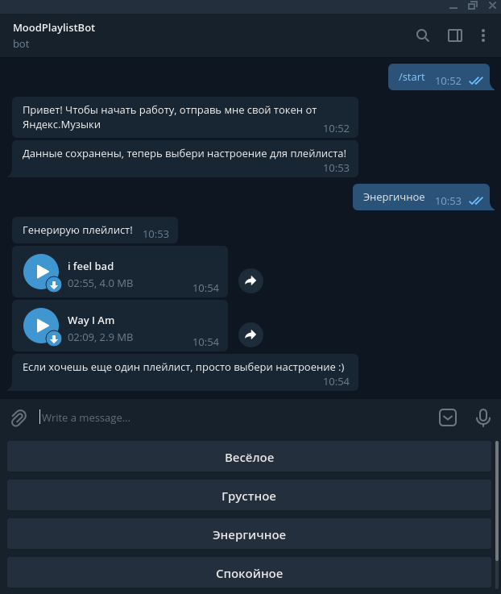

# MoodTelegramBot

Телеграм бот, генерирующий плейлист в зависимости от Вашего настроения.

### Использованы API:
* Yandex-music
* pyTelegramBotAPI

### Краткое описание принципа работы:
1. Получаем от пользователя информацию о требуемом настроении для плейлиста и токен
2. Авторизуемся в Yandex-music API
3. Устанавливаем настроение в качестве параметра для радио в Яндекс.Музыке
4. Загружаем полученные в радио песни и отправляем их пользователю

### Установка и запуск
<code>
git clone https://github.com/Axer1001/MoodTelegramBot

pip install -r requirements.txt  
cd MoodTelegramBot  
python3.8 main.py  
</code>

В файл main.py в переменную **TOKEN** нужно положить токен Вашего телеграм бота. 

### Пример работы

После получения токена бот удаляет сообщение с ним для сохранения приватности.

В связи с медленным соединением плейлисты с большим количеством песен загружаются долго, поэтому в плейлисте для демонстрации всего два трека.